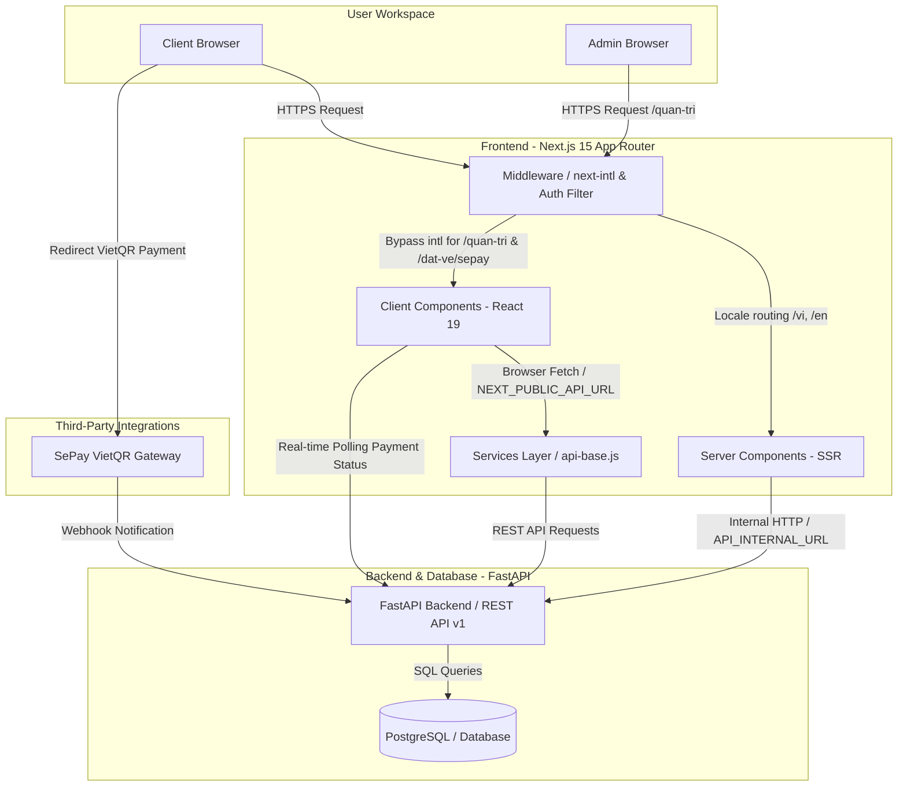
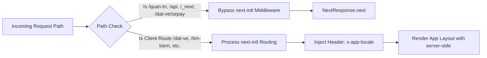
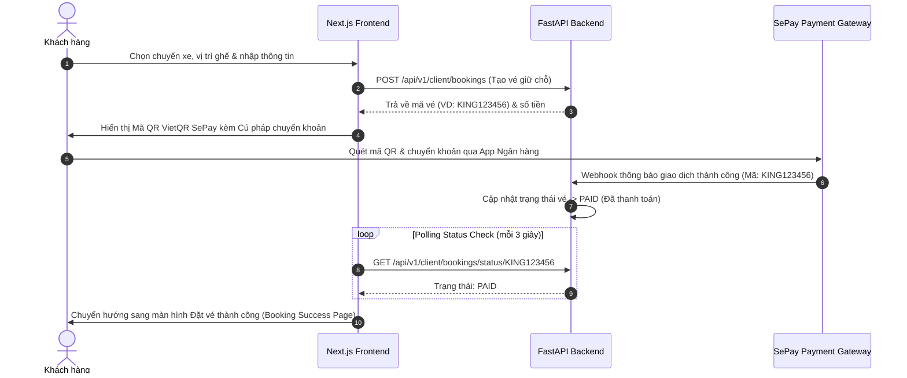

# System Architecture & Technical Flow

## 1. High-Level Architecture Diagram

Sơ đồ thể hiện luồng tương tác giữa Trình duyệt người dùng (Client Browser), Next.js Frontend App Router (SSR/CSR & Middleware), FastAPI Backend Service và Cổng thanh toán SePay.

---

## 2. Dynamic Locale Resolution & Middleware Pattern

Next.js Middleware (`src/middleware.js`) đóng vai trò điều hướng giao lộ cho ứng dụng:

### Điểm đặc biệt trong thiết kế Header Injection:
Do `src/app/layout.jsx` nằm ở cấp độ gốc (shared layout giữa `/quan-tri` unprefixed và `[locale]` client portal), nó không thể trực tiếp đọc tham số `params.locale`. 
Middleware tự động phân tích segment ngôn ngữ đầu tiên và đưa vào request header `x-app-locale`. Component Root Layout đọc header này qua `next/headers` để render thẻ `<html lang="vi">` hoặc `<html lang="en">` chuẩn SEO hoàn toàn ở Server-Side.

---

## 3. End-to-End Booking & Payment Flow (SePay VietQR)

---

## 4. Environment Variables Resolution Matrix

Ứng dụng hỗ trợ môi trường kép (Dual-Environment) cho việc kết nối API:

| Môi trường | Biến môi trường | Mục đích |
|---|---|---|
| **Browser (Client-side)** | `NEXT_PUBLIC_API_URL` | URL công khai của Backend API (VD: `https://api.kingexpressbus.com` hoặc `http://localhost:8000`), được nhúng vào bundle JS khi build. |
| **Server (SSR / RSC)** | `API_INTERNAL_URL` | URL mạng nội bộ (VD: `http://api:8000` trong Docker network). Giúp Server Next.js gọi trực tiếp sang FastAPI mà không cần đi vòng qua Internet public IP. |
